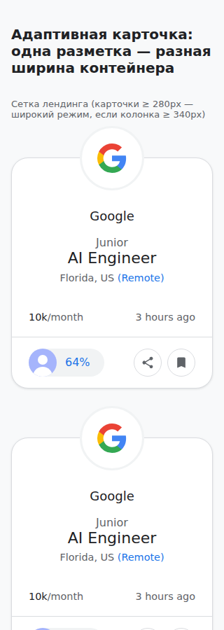
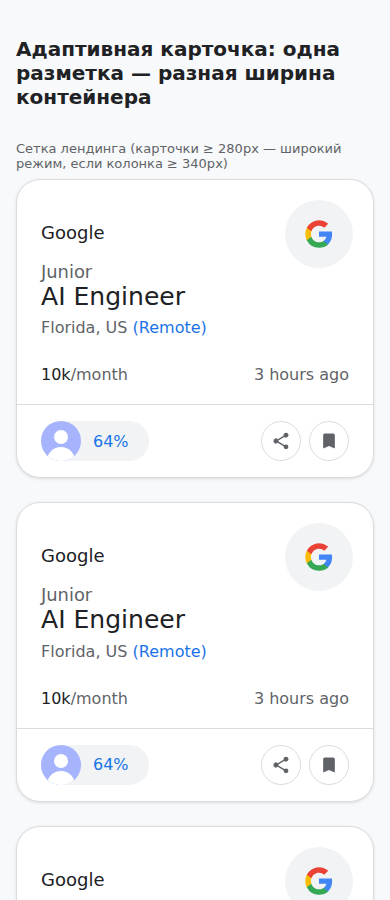
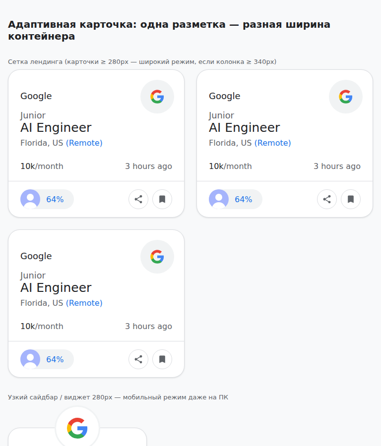
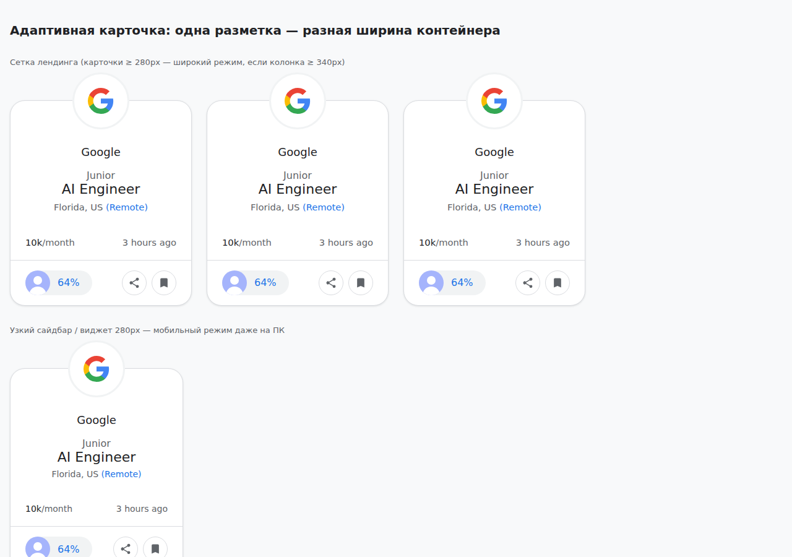
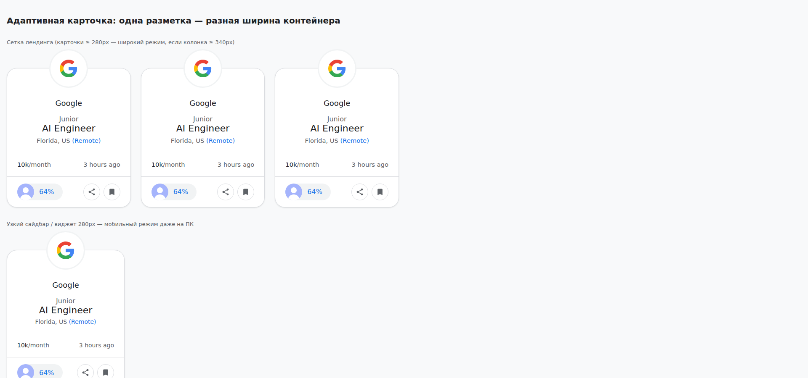

# Адаптивная карточка: поведение на разных устройствах

Карточка перестраивается по ширине своего контейнера (@container query), а не по ширине экрана. Два режима: узкий (< 340px) и широкий (≥ 340px).

| Режим | Ширина карточки | Логотип | Текст | Бейдж |
|---|---|---|---|---|
| **Узкий** | < 340px | Центр, висит над | Центр | Только % |
| **Широкий** | ≥ 340px | Право вверху | Слева | % + «profile match» (от 400px) |

---

## Телефон 320px

**Контекст:** мобильный телефон, портретная ориентация (iPhone SE, старые Android).

```css
body { margin: 0; padding: 24px 16px; }
.grid { display: grid; grid-template-columns: repeat(auto-fill, minmax(280px, 1fr)); gap: 24px; }
```

**Доступная ширина:** 320 − 32px (боковые отступы) = 288px.  
**Ширина карточки в сетке:** 288px (**узкий режим**).  
**Что видит пользователь:** компания и должность по центру, логотип подвешен над карточкой наполовину, бейдж показывает только процент (64%), кнопки внизу.



---

## Телефон 375–430px

**Контекст:** стандартные смартфоны (iPhone 11–15, большинство Android).

```css
body { margin: 0; padding: 24px 16px; }
.grid { display: grid; grid-template-columns: repeat(auto-fill, minmax(280px, 1fr)); gap: 24px; }
```

**Доступная ширина:** 390 − 32px = 358px.  
**Ширина карточки:** 358px (**широкий режим**, ≥ 340px).  
**Что видит пользователь:** логотип в правом верхнем углу (размер 68–80px), компания и должность слева, бейдж показывает только % (кнопки не помещаются), текст не залезает под логотип.

Подпись «profile match» не видна (нужно ≥ 400px).



---

## Планшет 768px

**Контекст:** планшет, портретная ориентация (iPad mini, Android tablets).

```css
body { margin: 0; padding: 24px 16px; }
.grid { display: grid; grid-template-columns: repeat(auto-fill, minmax(280px, 1fr)); gap: 24px; }
```

**Доступная ширина:** 768 − 32px = 736px.  
**Сетка:** 2 колонки по 356px (736 − 24px гэп) / 2.  
**Ширина карточки:** 356px (**широкий режим**, ≥ 340px).  
**Что видит пользователь:** две карточки рядом в альбомной ориентации или одна в портретной, логотип справа вверху, текст слева, бейдж компактный (только %).



---

## Ноутбук 1280px

**Контекст:** десктоп, ноутбук.

```css
body { margin: 0; padding: 24px 16px; }
.grid { display: grid; grid-template-columns: repeat(auto-fill, minmax(280px, 1fr)); gap: 24px; }
```

**Доступная ширина:** 1280 − 32px = 1248px.  
**Сетка:** 4 колонки × (1248 − 3×24px гэп) / 4 = 294px каждая.  
**Ширина карточки:** 294px (**узкий режим**, < 340px).  
**Что видит пользователь:** логотип по центру, висит наполовину над, текст по центру, бейдж с одним %, две кнопки внизу. Карточка меньше 340px, поэтому включается узкий режим, несмотря на широкий экран.



---

## Широкий экран 1920px

**Контекст:** монитор 4K, большой десктоп, масштаб 100%.

```css
body { margin: 0; padding: 24px 16px; }
.grid { display: grid; grid-template-columns: repeat(auto-fill, minmax(280px, 1fr)); gap: 24px; }
```

**Доступная ширина:** 1920 − 32px = 1888px.  
**Сетка:** 6 колонок × (1888 − 5×24px гэп) / 6 = 295px каждая.  
**Ширина карточки:** 295px (**узкий режим**, < 340px).  
**Что видит пользователь:** то же, что на 1280px — узкий режим. Шесть карточек в строку, каждая в узком режиме с логотипом по центру, две кнопки внизу.



---

## Виджет-сайдбар 280px

**Контекст:** боковая колонка на сайте, виджет платформы, узкий сайдбар.

```css
.sidebar { width: 280px; max-width: 100%; }
```

**Ширина карточки:** 280px (**узкий режим**, < 340px).  
**Что видит пользователь:** логотип по центру наполовину над, компания и должность по центру, бейдж с %, две кнопки внизу. Даже на 1280px десктопе карточка в узком режиме, потому что контейнер 280px.


---

## Правило для вёрстки

**Сетка автоматически:**
- 320px (1 колонка, 288px доступная) → узкий режим (логотип центр)
- 390px (1 колонка, 358px доступная) → широкий режим (логотип право-вверх)
- 768px (2 колонки, 356px каждая) → широкий режим
- 1280px+ (4–6 колонок, ~294–295px каждая) → узкий режим
- 280px сайдбар → узкий режим

Карточка сама знает свою ширину через `@container` и переключается без медиазапросов.

## Как получить широкий режим на ПК

На десктопе с `grid-template-columns: repeat(auto-fill, minmax(280px, 1fr))` карточки получают ~294px и остаются в узком режиме. Чтобы включить широкий режим (≥340px):

```css
/* Узкий режим (текущий) */
.grid {
  grid-template-columns: repeat(auto-fill, minmax(280px, 1fr));
  /* На 1280px → 4 колонки × 294px */
}

/* Широкий режим (широкие карточки) */
.grid {
  grid-template-columns: repeat(auto-fill, minmax(360px, 1fr));
  /* На 768px+ → 2 колонки × 356px; на 1280px → 3 колонки × 378px */
}
```

**Примечание:** Бейдж-лейбл (например, « profile match») появляется только при ≥400px. Поэтому для полного отображения бейджа используйте `minmax(420px, 1fr)` или установите 1–2 колонки (`grid-template-columns: repeat(2, 1fr)`).
